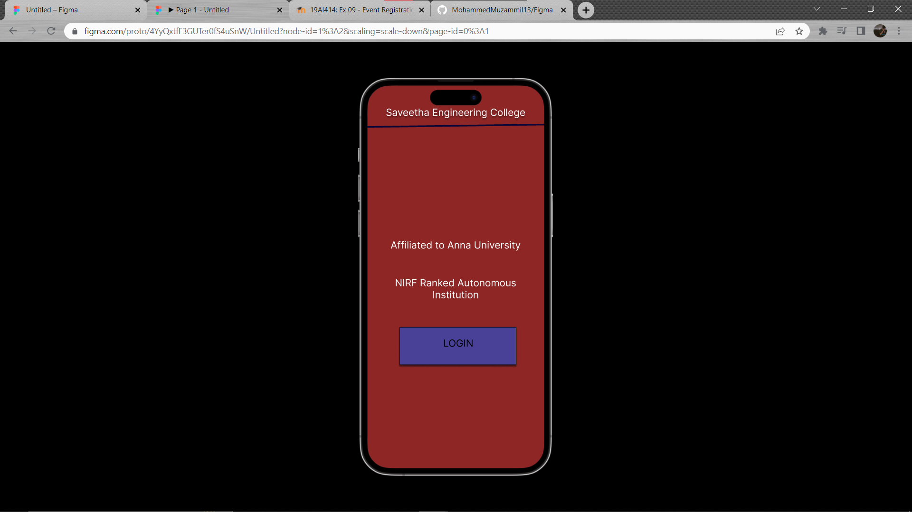
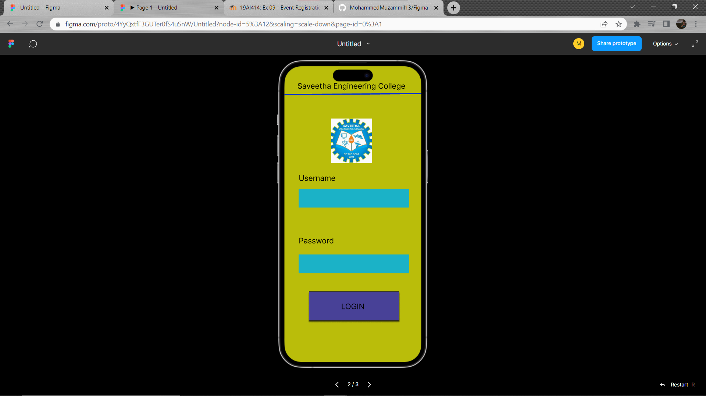
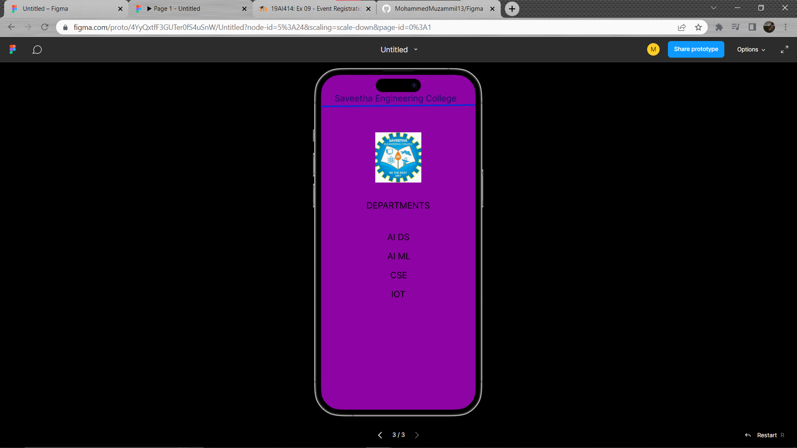

# Event Registration Web Application

## AIM:
To design, develop and deploy a web application for event registration.

## DESIGN STEPS:

### Step 1:
Create a new frame.

### Step 2:
Select any one preset size of your choice.

### Step 3:
Select the shapes you need.

### Step 4:
Import images as needed.

### Step 5:
Create pages based on your need and link them.

### Step 6:

Validate the HTML and CSS code.

### Step 6:

Publish the website in the given URL.

## DESIGN TOOL:
Figma

## CODE:
```
/* Home Page */


position: relative;
width: 430px;
height: 932px;

background: #8E2626;


/* logo 1 */


position: absolute;
width: 128px;
height: 140px;

background: url(logo.png);


/* Login Page */


position: relative;
width: 430px;
height: 932px;

background: #BABD0A;


/* Saveetha Engineering College */


position: absolute;
width: 363px;
height: 60px;
left: 33px;
top: 16px;

font-family: 'Inter';
font-style: normal;
font-weight: 400;
font-size: 24px;
line-height: 29px;
text-align: center;

color: #150D67;


/* Line 3 */
position: absolute;
width: 430.02px;
height: 0px;
left: 0px;
top: 90px;
border: 4px solid #002FD8;
transform: rotate(-0.53deg);


/* logo 3 */
position: absolute;
width: 128px;
height: 140px;
left: 151px;
top: 160px;
background: url(logo.png);


/* DEPARTMENTS */


position: absolute;
width: 177px;
height: 29px;
left: 126px;
top: 349px;
font-family: 'Inter';
font-style: normal;
font-weight: 400;
font-size: 24px;
line-height: 29px;
/* identical to box height */
text-align: center;
color: #000000;


/* Frame 2 */


/* Auto layout */

display: flex;
flex-direction: column;
align-items: flex-start;
padding: 10px;
gap: 10px;
position: absolute;
width: 102px;
height: 69px;
left: 106px;
top: 446px;


/* AI DS */


position: absolute;
width: 62px;
height: 29px;
left: 184px;
top: 437px;
font-family: 'Inter';
font-style: normal;
font-weight: 400;
font-size: 24px;
line-height: 29px;
/* identical to box height */
text-align: center;
color: #000000;

/* AI ML */


position: absolute;
width: 65px;
height: 29px;
left: 184px;
top: 490px;
font-family: 'Inter';
font-style: normal;
font-weight: 400;
font-size: 24px;
line-height: 29px;
/* identical to box height */
text-align: center;
color: #000000;


/* AI ML */


position: absolute;
width: 65px;
height: 29px;
left: 184px;
top: 490px;
font-family: 'Inter';
font-style: normal;
font-weight: 400;
font-size: 24px;
line-height: 29px;
/* identical to box height */
text-align: center;
color: #000000;


/* CSE */


position: absolute;
width: 48px;
height: 29px;
left: 192px;
top: 543px;
font-family: 'Inter';
font-style: normal;
font-weight: 400;
font-size: 24px;
line-height: 29px;
/* identical to box height */
text-align: center;
color: #000000;


/* IOT */


position: absolute;
width: 40px;
height: 29px;
left: 195px;
top: 596px;
font-family: 'Inter';
font-style: normal;
font-weight: 400;
font-size: 24px;
line-height: 29px;
/* identical to box height */
text-align: center;
color: #000000;
```


## OUTPUT:




## RESULT:
The program to design, develop and deploy a web application for event registration is completed successfully.